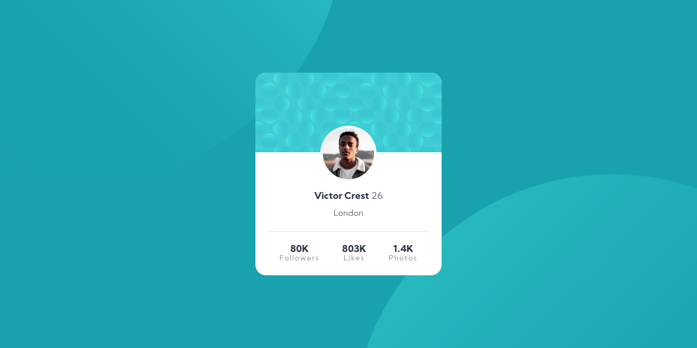

# Frontend Mentor - Profile card component solution

This is a solution to the [Profile card component challenge on Frontend Mentor](https://www.frontendmentor.io/challenges/profile-card-component-cfArpWshJ). Frontend Mentor challenges help you improve your coding skills by building realistic projects. 

## Table of contents

- [Overview](#overview)
  - [The challenge](#the-challenge)
  - [Screenshot](#screenshot)
  - [Links](#links)
- [My process](#my-process)
  - [Built with](#built-with)
  - [What I learned](#what-i-learned)
  - [Continued development](#continued-development)
  - [Useful resources](#useful-resources)
- [Author](#author)

## Overview

### The challenge

- Build out the project to the designs provided

### Screenshot

### Links

- Solution URL: [Add solution URL here](https://www.frontendmentor.io/solutions/profile-card-component-using-flexbox-FedLOeNj5)
- Live Site URL: [Add live site URL here](https://virgiliovalentin.github.io/html-css-playground/profile-card/)

## My process

### Built with

- Semantic HTML5 markup
- CSS custom properties
- Flexbox
- Mobile-first workflow

### What I learned

This challenged helped me to keep working on my Flexbox skills. I found it easier than my first Frontend Mentors challege and I believe I got the hang of fixing the sizing of the container when zooming out, which I had trouble with on my first challenge.

### Continued development

I want to keep using Flexbox, but I'll dabble in CSS Grid to check how I can handle a project with that. 

### Useful resources

- [Bluuweb's live coding video](https://www.youtube.com/watch?v=Xe_qNR1mmCg) - This really helped me to get some extra understanding on some concepts, even though I didn't use SASS in this project.

## Author

- Frontend Mentor - [@virgiliovalentin](https://www.frontendmentor.io/profile/virgiliovalentin)
- Twitter - [@virgiliovalentn](https://www.twitter.com/virgiliovalentn)