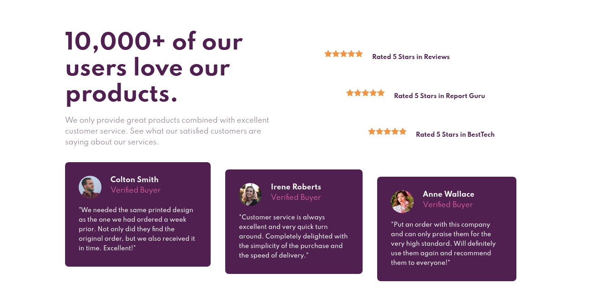

# Frontend Mentor - Social proof section solution

This is a solution to the [Social proof section challenge on Frontend Mentor](https://www.frontendmentor.io/challenges/social-proof-section-6e0qTv_bA). Frontend Mentor challenges help you improve your coding skills by building realistic projects. 

## Table of contents

- [Overview](#overview)
  - [The challenge](#the-challenge)
  - [Screenshot](#screenshot)
  - [Links](#links)
- [My process](#my-process)
  - [Built with](#built-with)
  - [What I learned](#what-i-learned)
  - [Useful resources](#useful-resources)
- [Author](#author)

## Overview

### The challenge

Users should be able to:

- View the optimal layout for the section depending on their device's screen size

### Screenshot

### Links

- Solution URL: [Add solution URL here](https://your-solution-url.com)
- Live Site URL: [Add live site URL here](https://your-live-site-url.com)

## My process

### Built with

- Semantic HTML5 markup
- CSS custom properties
- Flexbox
- Mobile-first workflow

### What I learned

On this challenge, I started thinking of using CSS Grid, but found out that it was better to think in just one direction for the most part, so I went with Flexbox once again. It was a bit of a challenge to be honest, since the positioning of several elements was not something I had dealt before.

### Useful resources

- [the :nth-child() CSS pseudo-class](https://developer.mozilla.org/en-US/docs/Web/CSS/:nth-child) - This helped me to style the position of the cards and star ratings in a way I didn't use before. It was pretty nice to know about it and use it.

## Author

- Frontend Mentor - [@virgiliovalentin](https://www.frontendmentor.io/profile/virgiliovalentin)
- Twitter - [@virgiliovalentn](https://www.twitter.com/virgiliovalentn)