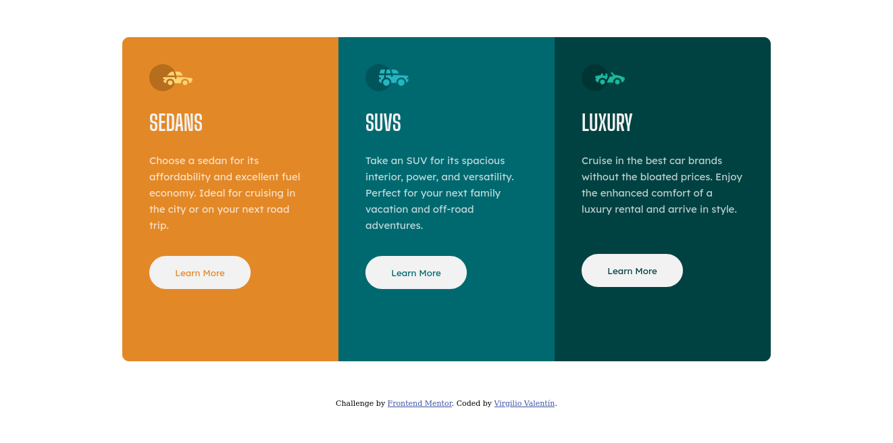

# Frontend Mentor - 3-column preview card component solution

This is a solution to the [3-column preview card component challenge on Frontend Mentor](https://www.frontendmentor.io/challenges/3column-preview-card-component-pH92eAR2-). Frontend Mentor challenges help you improve your coding skills by building realistic projects. 

## Table of contents

- [Overview](#overview)
  - [The challenge](#the-challenge)
  - [Screenshot](#screenshot)
  - [Links](#links)
- [My process](#my-process)
  - [Built with](#built-with)
  - [What I learned](#what-i-learned)
- [Author](#author)

## Overview

### The challenge

Users should be able to:

- View the optimal layout depending on their device's screen size
- See hover states for interactive elements

### Screenshot

### Links

- Solution URL: [Add solution URL here](https://www.frontendmentor.io/solutions/three-column-card-component-with-flexbox-RbmqKhy1O)
- Live Site URL: [Add live site URL here](https://virgiliovalentin.github.io/html-css-playground/three-column-card/)

## My process

### Built with

- Semantic HTML5 markup
- CSS custom properties
- Flexbox
- Mobile-first workflow

### What I learned

This was another challenge where I put my Flexbox skills to test. I began visualizing the layout with CSS Grid, but found out that Flexbox was better suited and a bit easier to work with this design. I think I learned how to fix my previous error where zooming out on desktop view just made the container larger. I fixed it by setting a width as well as a height value, which I usually think it's either one or the other, but in this case helped me to fix that.

## Author

- Frontend Mentor - [@virgiliovalentin](https://www.frontendmentor.io/profile/virgiliovalentin)
- Twitter - [@virgiliovalentn](https://www.twitter.com/virgiliovalentn)